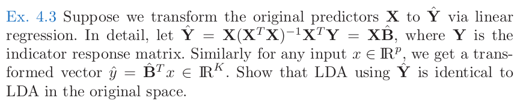

# The Elements of Statistical Learning Ex 4.3的一种解法

最近由于疫情长期锁在家里，闲暇时间略微增多，于是就把一些之前想看但是没有时间看的书翻出来阅读一下。这本Hastie, Tibshirani & Friedman的《The Elements of Statistical Learning》是统计学习界的过气网红（说过气，其实也就是10年前红过，奈何机器学习领域变化实在太快太剧烈，于是10年后就成了前浪）。对于一个每天大部分时间和数据打交道，只有很短时间才能享受模型训练的人来说（还不说很多时候所谓模型训练也就是调用一个人家写好的包里面的函数而已），搞懂这些经典方法后面的所以然还是挺有意义，同时也很有意思的。希望到时候研读完全书能有机会写一个详细的书评。

最近读了此书的Linear Discriminant Analysis (LDA)这部分。这次读由于想详细理解内容所以有意多关注每章之后的习题，发现4.3题在各大论坛和各路牛人出的Notes上都看不到解答。估计是各位牛人觉得此题太简单于是就不屑于开动牛刀。在下不才，想破脑壳得到一解，愿与大家分享，如果错误也请各位牛人指正。

原题如下：

简而言之，也就是说如果先给数据所有的$X$做一个最小二乘法回归以后，再把得到的回归拟合后的结果做LDA，会得到一个相同的LDA结果。

按照书内LDA的推演，如果数据集有$K$个不同的类别，则每个类别的linear discriminate function，可以等价认为是从数据得出它是类别$k$的似然（likelihood）是：

$$
\delta_k = X^T\Sigma^{-1}\mu_k - \frac{1}{2}\mu_{k}^{T}\Sigma^{-1}\mu_{k} + \log{\pi_k}
$$

其中$\mu_{k}$，$\Sigma$，$\pi_{k}$分别是：

$$
\mu_{k} = \frac{\sum_{g_i=k}Xi}{N_{k}} \\
\Sigma = \frac{\sum_{k}\sum_{g_i=k} (X_i - \mu_{k})^{T}(X_i - \mu_{k})}{N-K} \\
\pi_{k} = \frac{N_k}{N}
$$

换句话说，$\mu_{k}$是训练集内所有$k$类的数据的平均中心，$\pi_k$是在训练集中$k$类的比率（也就是该类的先验概率 prior probability），而$\Sigma$也是就是训练集中考虑所有数据点的协方差矩阵（covariance matrix）。由于在LDA中假设所有类的协方差矩阵都是一致的，所以这里只有一个统一的协方差矩阵。

好，下面开始进入正题。4.3的意思其实就是这个linear discriminant function用$X$或者$\hat{Y}$是一致的。试证明如下：

如题所述，最小二乘法得到$\hat{Y}$为：

$$
\hat{Y} = X(X^TX)^{-1}X^TY = XB
$$

有此得到在拟合后的向量和$X$的关系为：

$$
y_{i} = B^{T}x_{i}
$$
 

接下来我们来计算如果用$y_i$来做LDA的话，linear discriminant function会变成什么样，首先是$\pi_{k}$，显然，使用拟合后的$y$并不改变训练集中$k$类的比率。也就是说$\pi'_{k} = \pi_{k}$，下面看 $\mu$：

$$
\mu'_{k} = \frac{\sum_{g_i=k}y_i}{N_{k}} = \frac{\sum_{g_i=k}B^{T}x_i}{N_{k}} = \frac{B^{T}\sum_{g_i=k}x_i}{N_{k}} = B^{T}\mu_{k}
$$

最后看$\Sigma$， 首先我们需要用到一个统计和线性代数里面的一个定理：如果有$Z=AX$，而且$X$的协方差矩阵是$\Sigma_{xx}$，则$Z$的协方差矩阵是$\Sigma_{zz} = A^T\Sigma_{xx}A$。在这里，明显我们的$y_i$是$x_i$的线性组合，所以我们有：

$$
\Sigma' = B^{T}\Sigma B
$$

在linear discriminant function中，我们需要的是协方差矩阵的逆。已知两个协方差矩阵的关系如上式，那么他们的逆之间的关系是什么呢？

首先，协方差矩阵根据它的定义，它一定是实对称矩阵。所有的实对称矩阵都能被对角化为：

$$
\Sigma = S^T\Lambda S
$$

而且S是正交归一（orthogonormal）矩阵，也就算是$S^TS = I$。由此，$\Sigma' = B^TS^T\Lambda SB = (SB)^T \Lambda (SB)$。可以看出$SB$就是另外一组让$\Sigma'$对角化的特征向量。虽然$SB$并不一定是正交归一的。

为了求逆，我们可以根据线性代数中对角化矩阵幂的关系得知，$\Sigma$的逆就是$\Sigma^{-1} = S^T\Lambda^{-1}S$。而$\Sigma'$的逆就是

$$
\Sigma'^{-1}\Sigma' = [B^{-1}S^T\Lambda^{-1}S(B^T)^{-1}] * [B^TS^T\Lambda SB] = I \\
\therefore \Sigma'^{-1} = B^{-1}S^T\Lambda^{-1}S(B^T)^{-1} = B^{-1}\Sigma^{-1}(B^T)^{-1}
$$

最后，把这些带入linear discriminant function的得到：

$$
\delta'_k = X^TBB^{-1}\Sigma^{-1}(B^T)^{-1}B^{T}\mu_k - \frac{1}{2}\mu_{k}^{T}BB^{-1}\Sigma^{-1}(B^T)^{-1}B^T\mu_{k} + \log{\pi_k} \\
= X^T\Sigma^{-1}\mu_k - \frac{1}{2}\mu_{k}^{T}\Sigma^{-1}\mu_{k} + \log{\pi_k} \\
= \delta_{k}
$$

证毕。

回看这个证明的过程和结论，仔细想想也有道理。线性拟合后，数据从$\R^{p}$空间被线性变化映射到$\R^{k}$空间，而LDA本来就是把$\R^{p}$空间的数据降维到$R^{k}$空间上的不同的多元高斯分布，所以当然他们会得到一致的结果。